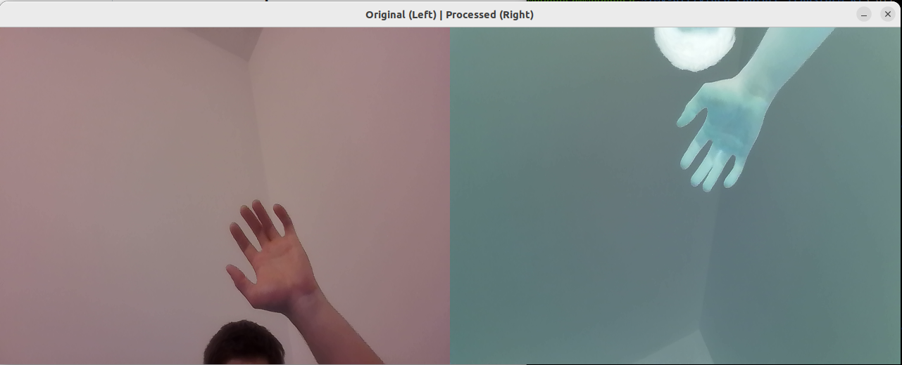

# video_capture_transform_RT
## Video stream captured from camera and modified in real time using C++ and Open Computer Vision Library.

### Step 0: clone repository
$ git clone https://github.com/MarianNoaghea/video_capture_transform_RT.git

### Step 1: install
$ sudo apt update && sudo apt install libopencv-dev -y

### Step 2: compile
$ make build

### Step 3: run
$ make run

## Demo my_demo.mkv on repo ss below

